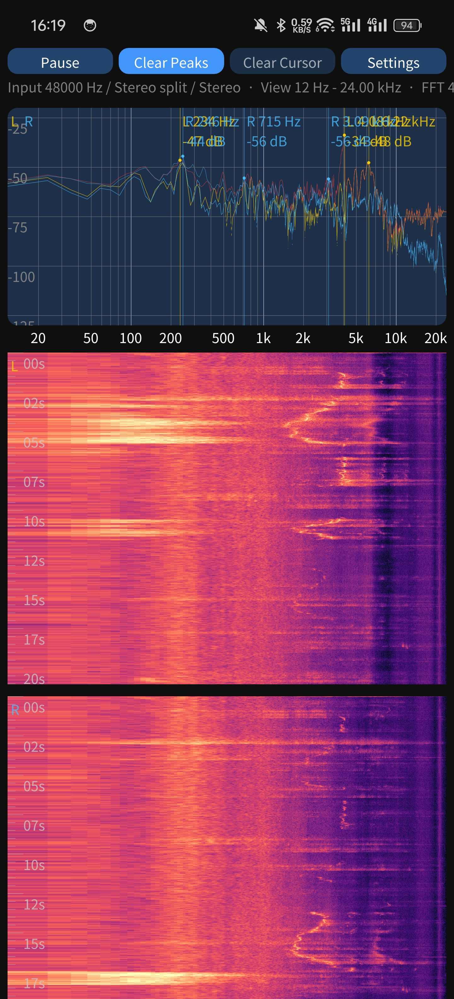
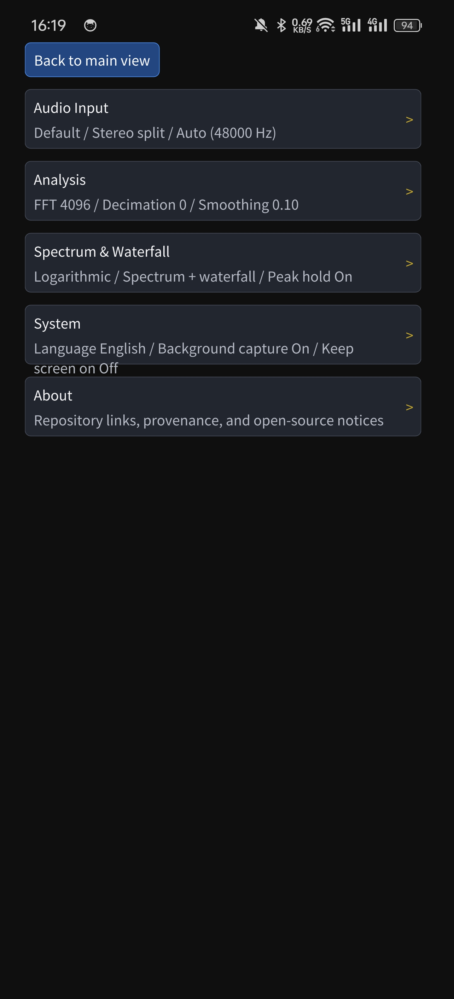

# Spectrogrammer

Real-time audio spectrum analyzer for Android phones, with a Linux build path still available for local development. This fork continues from upstream `Spectrogrammer` and focuses on mobile usability, stereo visualization, waterfall inspection, background capture, and touch-first controls.

Chinese documentation:
- [README.zh-CN.md](README.zh-CN.md)
- [docs/android-build-install.zh-CN.md](docs/android-build-install.zh-CN.md)
- [docs/fork-differences.zh-CN.md](docs/fork-differences.zh-CN.md)

## Features
- Real-time spectrum trace and waterfall, with independent toggles for the upper spectrum and lower waterfall areas
- Frequency-axis scales: `Linear`, `Logarithmic`, `Music log`, `Mel`, `Bark`, `ERB`
- Channel modes: `Mono`, `Left channel`, `Right channel`, `Stereo mix`, `Stereo difference`, `Stereo split`
- English UI by default, with an in-app switch to Simplified Chinese under `System > Language`
- Adjustable input gain from `-24 dB` to `+24 dB`
- Peak-hold trace with configurable falloff or no falloff
- Peak markers selectable from `Live` or `Short hold`
- Manual cursor line with frequency and dB readout, movable by tap or drag
- Pinch zoom and horizontal pan for close inspection of specific frequency ranges
- Adjustable overlay text size and opacity
- Background capture, keep-screen-on support, Android back handling, and foreground-service persistence

## Quick Start
1. Install the APK and grant microphone permission.
2. The four top buttons are `Pause/Resume`, `Clear Peaks`, `Clear Cursor`, and `Settings`.
3. Tap or drag on the spectrum or waterfall to move the manual cursor and inspect the current frequency and dB level.
4. Use a two-finger gesture to zoom or pan horizontally.
5. Open `Settings` to access the categorized pages: `Audio Input`, `Analysis`, `Spectrum & Waterfall`, `System`, and `About`.

## Settings Overview

### Audio Input
- `Audio source`: Android recording preset such as `Default`, `Generic`, `Voice recognition`, `Camcorder`, or `Unprocessed`
- `Channel mode`: Select `Mono`, `Left channel`, `Right channel`, `Stereo mix`, `Stereo difference`, or `Stereo split`
- `Swap left/right order`: Only shown in stereo split mode; swaps the two display panels
- `Input gain`: Display-path gain adjustment from `-24 dB` to `+24 dB`
- `Sample rate`: Automatic or fixed sample rate; actual availability depends on device and driver support

### Analysis
- `FFT size`: Balance between frequency resolution and update cost, from `128` to `8192`
- `Decimation stages`: Downsample before FFT for finer low-frequency resolution while reducing the visible upper frequency limit
- `Window function`: `Rectangular`, `Hann`, `Hamming`, or `Blackman-Harris`
- `Exponential smoothing`: Larger values produce a steadier trace

### Spectrum & Waterfall
- `Frequency axis scale`: Switch among `Linear`, `Logarithmic`, `Music log`, `Mel`, `Bark`, and `ERB`
- `Overlay text size`: Adjust peak labels, cursor readout, and split-channel legends
- `Overlay text opacity`: Control overlay readability versus plot visibility
- `Show peak-hold trace`: Toggle the held peak trace
- `Peak falloff time`: Peak-hold decay time, where `0` means no falloff and the maximum is `120 s`
- `Peak markers`: Show `0 / 1 / 3 / 5` markers
- `Peak marker source`: Choose `Live` or `Short hold`
- `Show upper spectrum`: Disable to show only the waterfall
- `Show waterfall`: Disable to show only the upper spectrum
- `Waterfall height`: Set how much of the screen the waterfall occupies
- `Scroll speed`: Waterfall row interval, adjustable from `2 ms` to `250 ms`

### System
- `Language`: `English` or `简体中文`
- `Background capture`: Continue recording and processing while the app is in the background
- `Keep screen on`: Prevent the display from sleeping during use

### About
- Repository link and high-level provenance / open-source information

## Default Configuration
- Language: `English`
- Audio source: `Default`
- Channel mode: `Stereo split`
- Input gain: `0 dB`
- Sample rate: `Auto (48 kHz)`
- FFT size: `4096`
- Exponential smoothing: `0.10`
- Peak marker source: `Short hold`
- Peak-hold trace: enabled with a default `4 s` falloff
- Background capture: enabled

## Screenshot



## Build

### Android
From the repository root:

```bash
make init-submodules
make doctor-android
make BUILD_ANDROID=y
```

Common commands:

```bash
make push
make run
make logcat
make clean
```

Notes:
- `make BUILD_ANDROID=y` produces `Spectrogrammer.apk`
- The APK uses the repository test signing setup and is intended for local installation and debugging
- `make doctor-android` checks SDK, NDK, build-tools, submodules, and required command-line tools
- The current Android target API is `29`

### Linux
```bash
make BUILD_ANDROID=n
```

## Repository Layout
- `src/app`: spectrum UI, axes, waterfall, configuration, and FFT-related logic
- `src/audio`: audio capture and platform audio backends
- `src/java`: Android foreground-service glue
- `fastlane/metadata`: store listing metadata and screenshots
- `submodules/imgui`, `submodules/kissfft`: upstream dependencies

## Notes
- High sample rates and the `Unprocessed` audio source depend entirely on device and driver support.
- When a fixed sample rate is not supported, the app falls back to a lower working rate when possible.
- The repository currently prioritizes Android phone usability; Linux support remains available but is not the main optimization target.

## Licensing and Provenance
- This repository is a fork and derivative of `aguaviva/Spectrogrammer`, and it still contains inherited or adapted upstream code.
- No single license applies to every file in this repository; see file headers, bundled component licenses, [LICENSE](LICENSE), and [NOTICE](NOTICE).
- Known origins include Android Open Source Project native audio sample code, `cnlohr/rawdrawandroid`, `Dear ImGui`, `KISS FFT`, and fork-added code for this repository.
- Fork-added standalone files that do not carry inherited upstream code are available under Apache License 2.0; the current list is summarized in [NOTICE](NOTICE).

## Acknowledgements
- [aguaviva/Spectrogrammer](https://github.com/aguaviva/spectrogrammer)
- [cnlohr/rawdrawandroid](https://github.com/cnlohr/rawdrawandroid)
- [mborgerding/kissfft](https://github.com/mborgerding/kissfft)
- [ocornut/imgui](https://github.com/ocornut/imgui)
