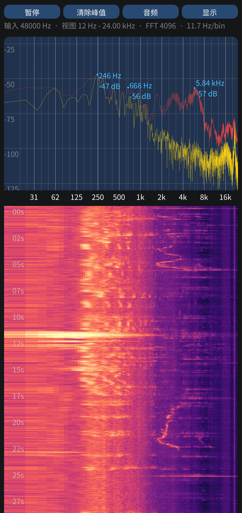

# 频谱仪 / Spectrogrammer

一个面向 Android 手机的实时音频频谱分析器。由于 Spectroid 软件不开源且不足以满足部分需求，因此基于上游 `Spectrogrammer` 的 fork 继续演进，重点围绕中文界面、后台持续分析、手机触控交互、双声道显示与频谱/瀑布图查看做了较大重构。

## 主要特性
- 实时频谱曲线与瀑布图，可单独显示上方频谱图、下方瀑布图，或两者同时显示
- 频率轴支持 `线性`、`普通对数`、`音乐对数`、`Mel`、`Bark`、`ERB`
- 声道模式支持 `单声道`、`左声道`、`右声道`、`双声道混合`、`双声道相减`、`双声道独立`
- 双声道独立模式支持 `交换左右顺序`，默认显示为 `左 | 右`
- 输入增益可调，范围 `-24 dB` 到 `+24 dB`
- 峰值保持曲线支持自动回落或不回落，峰值标记可切换 `实时峰值` / `短时峰值`
- 手动游标线支持点击或拖动定位，并可一键 `清除游标`
- 双指缩放和平移频率视图，便于观察局部频段
- 图上标注字号与透明度可调，适配不同屏幕和观感
- 中文化分类设置首页 + 子页，适合手机竖屏触控
- Android 后台采集、保持亮屏、返回键回主界面、前台服务保活等行为适配
- 主体逻辑以 C/C++ 实现，Android 额外带一个前台服务 Java 类

## 快速上手
1. 安装 APK 并授予录音权限。
2. 主界面顶部四个按钮分别是 `暂停/继续`、`清除峰值`、`清除游标`、`设置`。
3. 在主图或瀑布图上单指点击或拖动，可移动手动游标并查看当前位置的频率与 dB。
4. 双指左右缩放或平移，可聚焦某个频段。
5. 进入 `设置` 后，先看到分类首页；可进入各个子页调整参数，并可用页面顶部返回按钮或 Android 返回键逐级返回。

## 设置速览
设置页现为 `分类首页 + 子页` 结构，首页提供 `音频输入`、`分析处理`、`频谱与瀑布`、`系统`、`关于` 五个入口。

### 音频与处理
- `音频源`：切换 Android 录音 preset，如默认、通用、语音识别、摄像机、未处理。
- `声道模式`：切换 `单声道`、`左声道`、`右声道`、`双声道混合`、`双声道相减`、`双声道独立`。
- `交换左右顺序`：仅在双声道独立时出现，用于对调两个独立面板的显示顺序。
- `输入增益`：对当前分析显示链做增益调节，范围 `-24 dB` 到 `+24 dB`。
- `采样率`：自动或固定采样率。实际可用档位取决于设备和驱动。
- `FFT 大小`：频率分辨率和刷新负担的平衡，当前范围为 `128` 到 `8192`。
- `抽取级数`：先降采样再做频谱，分辨率更细，但最高可显示频率会下降。
- `窗函数`：控制频谱泄漏与主瓣宽度。
- `指数平滑因子`：曲线平滑程度，数值越大越平滑。

### 频谱与瀑布图
- `图上标注字号`：调整峰值文字、游标读数、双声道标签等覆盖文字大小。
- `图上标注透明度`：调整这些覆盖文字的整体透明度。
- `频率轴刻度`：切换 `线性`、`普通对数`、`音乐对数`、`Mel`、`Bark`、`ERB`。
- `显示上方频谱图`：关闭后可只保留瀑布图。
- `显示瀑布图`：关闭后只保留上方频谱图。
- `瀑布图高度`：设置瀑布图占屏比例。
- `滚动速度`：瀑布图滚动速度，范围 `2 ms` 到 `250 ms`，界面从慢到快调节。

### 峰值与运行
- `显示峰值保持曲线`：显示或隐藏峰值保持曲线。
- `峰值回落时长`：峰值保持回落速度，`0` 表示不回落，最大 `120 s`。
- `峰值标记`：显示 `0 / 1 / 3 / 5` 个峰值点。
- `峰值标记来源`：从实时曲线或短时峰值曲线中找峰值。
- `后台采集`：切到后台时继续录音与处理。
- `保持亮屏`：运行时阻止屏幕自动熄灭。
- `关于`：独立子页，提供 GitHub 仓库链接和来源说明。

## 默认配置
- 音频源：`默认`
- 声道模式：`双声道独立`
- 输入增益：`0 dB`
- 采样率：`自动（48 kHz）`
- FFT 大小：`4096`
- 平滑因子：`0.10`
- 峰值标记来源：`短时峰值`
- 峰值保持曲线：开启，默认 `4 秒` 回落
- 后台采集：开启

## 截图


## 构建
### Android
在仓库根目录执行：

```bash
make init-submodules
make doctor-android
make BUILD_ANDROID=y
```

常用命令：

```bash
make push
make run
make logcat
make clean
```

说明：
- `make BUILD_ANDROID=y` 会产出 `Spectrogrammer.apk`
- APK 默认使用仓库内测试签名，仅适合本地安装与调试
- `make doctor-android` 会检查 SDK、NDK、build-tools、子模块和必要命令
- 当前 Android 目标 API 为 `29`

### Linux
```bash
make BUILD_ANDROID=n
```

## 目录说明
- `src/app`：频谱 UI、坐标轴、瀑布图、配置和 FFT 相关逻辑
- `src/audio`：音频采集与平台驱动封装
- `src/java`：Android 前台服务
- `fastlane/metadata`：应用发布元数据和截图
- `submodules/imgui`、`submodules/kissfft`：上游子模块依赖

## 已知注意事项
- 高采样率和 `未处理` 音频源是否可用，完全取决于设备和驱动实现。
- 固定采样率档位如果设备不支持，程序会尽量回退到更低且可用的采样率。
- 本仓库当前优先保证 Android 手机体验，Linux 路线仍保留但不是主要优化目标。

## 许可与来源
- 本仓库是 `aguaviva/Spectrogrammer` 的 fork 和衍生版本，当前仍包含继承和改写自上游的代码，不是从零重写。
- 当前仓库不对所有继承代码声明单一统一许可证；请以文件头声明、子目录许可证文件、[LICENSE](LICENSE) 和 [NOTICE](NOTICE) 为准。
- 已明确可识别的来源包括 Android Open Source Project 原生音频样例、`cnlohr/rawdrawandroid`、`Dear ImGui`、`KISS FFT` 以及本 fork 新增代码。
- 本 fork 新增且不含既有上游代码的独立文件，按 Apache License 2.0 提供；明确列表见 [NOTICE](NOTICE)。

## 致谢
- [aguaviva/spectrogrammer](https://github.com/aguaviva/spectrogrammer)
- [cnlohr/rawdrawandroid](https://github.com/cnlohr/rawdrawandroid)
- [mborgerding/kissfft](https://github.com/mborgerding/kissfft)
- [ocornut/imgui](https://github.com/ocornut/imgui)
