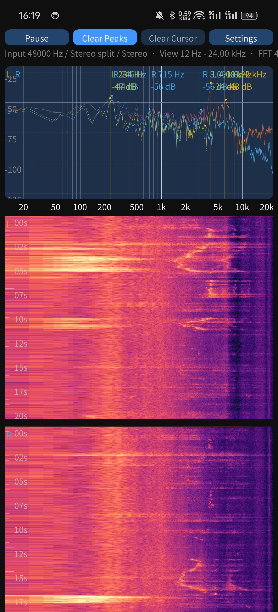
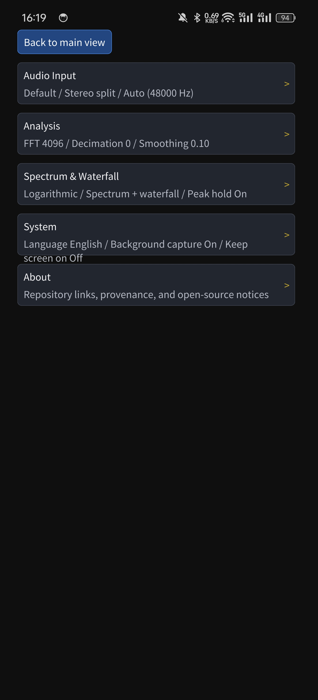

# Spectrogrammer

Real-time audio spectrum analyzer for Android phones, with a Linux build path still available for local development. This fork continues from upstream `Spectrogrammer` and focuses on mobile usability, stereo visualization, waterfall inspection, background capture, and touch-first controls.

Chinese documentation:
- [README.zh-CN.md](README.zh-CN.md)
- [docs/android-build-install.zh-CN.md](docs/android-build-install.zh-CN.md)
- [docs/fork-differences.zh-CN.md](docs/fork-differences.zh-CN.md)

## Features
- Real-time spectrum trace and waterfall, with independent toggles for the upper spectrum and lower waterfall areas
- Frequency-axis scales: `Linear`, `Logarithmic`, `Music log`, `Mel`, `Bark`, `ERB`
- Channel modes: `Mono`, `Left channel`, `Right channel`, `Stereo mix`, `Stereo difference`, `Stereo split`
- English UI by default, with an in-app switch to Simplified Chinese under `System > Language`
- Adjustable input gain from `-24 dB` to `+24 dB`
- Peak-hold trace with configurable falloff or no falloff
- Peak markers selectable from `Live` or `Short hold`
- Manual cursor line with frequency and dB readout, movable by tap or drag
- Pinch zoom and horizontal pan for close inspection of specific frequency ranges
- Adjustable overlay text size and opacity
- Background capture, keep-screen-on support, Android back handling, and foreground-service persistence
- **Audio file analysis**: tap `File` to pick a WAV file from the app external files directory (`/sdcard/Android/data/<package>/files`, reachable from file managers and `adb`) and analyze it with the same pipeline as live capture — spectrum, waterfall, peak hold, markers, cursor, pinch zoom, channel modes, plus a seek bar, pause/resume, and progress display
- **Level meter**: live input level in dBFS shown in the status line
- **Threshold alarm**: alarm on spectral peaks above a configurable dBFS threshold within a frequency range, with optional vibration and hysteresis
- **Time-averaged spectrum**: optional 16/32/64-frame exponential averaging for a steadier trace
- **Waterfall color maps**: `Magma`, `Hot/cold`, and `Grayscale`
- **Waterfall freeze**: keep the waterfall image while the spectrum keeps updating
- **Baseline difference curve**: subtract a saved reference (baseline) curve from the current spectrum, centered at 0 dB with a ±60 dB window
- **Cursor pinning**: lock the cursor frequency so zooming/panning does not lose it
- **PNG export**: save the waterfall (per channel) and spectrum to PNG files in the external files directory from the `Compare` menu
- **Compare menu** in settings: save/clear the baseline, load saved traces, and export images

## Quick Start
1. Install the APK and grant microphone permission.
2. The five top buttons are `File`, `Pause/Resume`, `Clear Peaks`, the cursor control (`Pin` / `Clear Cursor`), and `Settings`.
3. Tap `File` to open a local WAV file for offline analysis; the file bar shows playback position, a seek slider, and the file sample rate.
4. Tap or drag on the spectrum or waterfall to move the manual cursor and inspect the current frequency and dB level.
5. Use a two-finger gesture to zoom or pan horizontally.
6. Open `Settings` to access the categorized pages: `Audio Input`, `Analysis`, `Spectrum & Waterfall`, `Compare`, `System`, and `About`.

## Settings Overview

### Audio Input
- `Audio source`: Android recording preset such as `Default`, `Generic`, `Voice recognition`, `Camcorder`, or `Unprocessed`
- `Channel mode`: Select `Mono`, `Left channel`, `Right channel`, `Stereo mix`, `Stereo difference`, or `Stereo split`
- `Swap left/right order`: Only shown in stereo split mode; swaps the two display panels
- `Input gain`: Display-path gain adjustment from `-24 dB` to `+24 dB`
- `Sample rate`: Automatic or fixed sample rate; actual availability depends on device and driver support

### Analysis
- `FFT size`: Balance between frequency resolution and update cost, from `128` to `8192`
- `Decimation stages`: Downsample before FFT for finer low-frequency resolution while reducing the visible upper frequency limit
- `Window function`: `Rectangular`, `Hann`, `Hamming`, or `Blackman-Harris`
- `Exponential smoothing`: Larger values produce a steadier trace
- `Time-averaged spectrum`: `Off` or `16 / 32 / 64`-frame exponential average
- `Threshold alarm`: enable an alarm with a dBFS `Threshold`, a frequency range (0 = DC / Nyquist), and optional vibration when triggered

### Spectrum & Waterfall
- `Frequency axis scale`: Switch among `Linear`, `Logarithmic`, `Music log`, `Mel`, `Bark`, and `ERB`
- `Overlay text size`: Adjust peak labels, cursor readout, and split-channel legends
- `Overlay text opacity`: Control overlay readability versus plot visibility
- `Show peak-hold trace`: Toggle the held peak trace
- `Peak falloff time`: Peak-hold decay time, where `0` means no falloff and the maximum is `120 s`
- `Peak markers`: Show `0 / 1 / 3 / 5` markers
- `Peak marker source`: Choose `Live` or `Short hold`
- `Show upper spectrum`: Disable to show only the waterfall
- `Show waterfall`: Disable to show only the upper spectrum
- `Freeze waterfall`: Stop the waterfall scrolling while the spectrum keeps updating
- `Waterfall color map`: `Magma`, `Hot/cold`, or `Grayscale`
- `Show baseline difference curve`: Overlay `(current - baseline)` in dB, 0 dB centered, ±60 dB full scale
- `Waterfall height`: Set how much of the screen the waterfall occupies
- `Scroll speed`: Waterfall row interval, adjustable from `2 ms` to `250 ms`

### Compare
- `Save current curve as baseline`: Capture the current spectrum as the reference used by the difference curve
- `Clear baseline`: Remove the saved reference
- `Load saved trace`: Open a previously saved spectrum file from the app folder
- `Save image as PNG`: Export the spectrum and each visible waterfall to PNG files in the external files directory

### System
- `Language`: `English` or `简体中文`
- `Background capture`: Continue recording and processing while the app is in the background
- `Keep screen on`: Prevent the display from sleeping during use

### About
- Repository link and high-level provenance / open-source information

## Default Configuration
- Language: `English`
- Audio source: `Default`
- Channel mode: `Stereo split`
- Input gain: `0 dB`
- Sample rate: `Auto (48 kHz)`
- FFT size: `4096`
- Exponential smoothing: `0.10`
- Peak marker source: `Short hold`
- Peak-hold trace: enabled with a default `4 s` falloff
- Background capture: enabled

## Screenshot



## Build

### Android
From the repository root:

```bash
make init-submodules
make doctor-android
make BUILD_ANDROID=y
```

Common commands:

```bash
make push
make run
make logcat
make clean
```

Notes:
- `make BUILD_ANDROID=y` produces `Spectrogrammer.apk`
- The APK uses the repository test signing setup and is intended for local installation and debugging
- `make doctor-android` checks SDK, NDK, build-tools, submodules, and required command-line tools
- The current Android target API is `29`

### Linux
```bash
make BUILD_ANDROID=n
```

### Unit tests (host)
```bash
make test
```
Runs `tests/run_tests.cpp` on the dev machine (Linux/macOS). Covers config save/load and v11→v12 migration, config validation, color maps, the PNG writer (structure, CRCs, pixel round-trip), the FIR anti-alias decimator, the WAV file feeder, and the WAV file picker. Requires the host C/C++ toolchain and zlib development headers (e.g. `zlib1g-dev` / `brew install zlib`).

## Repository Layout
- `src/app`: spectrum UI, axes, waterfall, configuration, and FFT-related logic
- `src/audio`: audio capture and platform audio backends
- `src/java`: Android foreground-service glue
- `fastlane/metadata`: store listing metadata and screenshots
- `submodules/imgui`, `submodules/kissfft`: upstream dependencies

## Notes
- High sample rates and the `Unprocessed` audio source depend entirely on device and driver support.
- When a fixed sample rate is not supported, the app falls back to a lower working rate when possible.
- The alarm vibration uses the `VIBRATE` permission (normal permission, declared in the manifest).
- File analysis reads WAV files (16-bit PCM or 32-bit IEEE float, mono or stereo) from the app's external files directory; other formats are not supported.
- The repository currently prioritizes Android phone usability; Linux support remains available but is not the main optimization target.

## Recent Changes (this fork revision)
**New features**
- Audio file (WAV) analysis with the same feature set as live capture: spectrum, waterfall, peak hold, peak markers, cursor, pinch zoom/pan, channel modes, plus seek, pause/resume, and playback progress
- Input level meter (dBFS) in the status line
- Threshold alarm with frequency range, dBFS threshold, hysteresis, and optional vibration
- Time-averaged spectrum (16/32/64 frames)
- Waterfall color map selection (Magma / Hot-cold / Grayscale), waterfall freeze, and baseline difference curve
- Cursor pinning; PNG export of spectrum and waterfalls; Compare menu (baseline save/clear, trace load)

**Bug fixes**
- Recorder stall: the OpenSL ES capture pump is now driven by its own thread, so the analysis loop can no longer wedge the capture; a watchdog restarts a wedged session automatically
- Decimation aliasing: decimating now applies a windowed-sinc FIR anti-alias low-pass before downsampling, so out-of-band content no longer folds into the displayed spectrum
- Waterfall texture uploads are staged through a CPU copy and applied on the GL/UI thread, removing a cross-thread `glTexImage2D` race
- Config file: validated on load (clamped/enum-checked), saved atomically (tmp + rename), and migrated from v11 to v12
- Spectrum file load validates header fields and buffer sizes before use; save checks write results
- Hold-picker paths are built with length-checked `snprintf` instead of `strcpy`/concatenation
- `GetColorMap` no longer indexes out of bounds for unknown map ids; grayscale map is generated instead of a zero array
- Dead code removed (`audio_SLES.h` split into `audio_common.h`, `pass_through.h`, `BufferAverage.h`, `ModalSampleRate.*`, `draw_lines_fit`, `FloatToUint16`)
- Per-frame (not per-burst) lock scoping in the processing loop reduces UI-thread contention
- `keep_screen_on` JNI call is cached and only issued on state change

## Licensing and Provenance
- This repository is a fork and derivative of `aguaviva/Spectrogrammer`, and it still contains inherited or adapted upstream code.
- No single license applies to every file in this repository; see file headers, bundled component licenses, [LICENSE](LICENSE), and [NOTICE](NOTICE).
- Known origins include Android Open Source Project native audio sample code, `cnlohr/rawdrawandroid`, `Dear ImGui`, `KISS FFT`, and fork-added code for this repository.
- Fork-added standalone files that do not carry inherited upstream code are available under Apache License 2.0; the current list is summarized in [NOTICE](NOTICE).

## Acknowledgements
- [aguaviva/Spectrogrammer](https://github.com/aguaviva/spectrogrammer)
- [cnlohr/rawdrawandroid](https://github.com/cnlohr/rawdrawandroid)
- [mborgerding/kissfft](https://github.com/mborgerding/kissfft)
- [ocornut/imgui](https://github.com/ocornut/imgui)
